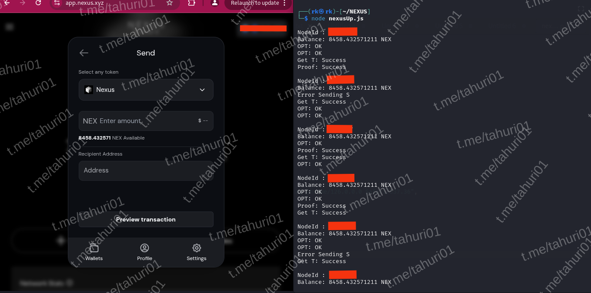

# BOT NEXUS - WEBSITE



**Fitur:**

**• Auto Connect**

## Requirements

Before running this project, make sure you have installed:

- Node.js
- npm (Node Package Manager)

## Installation

1. **Clone this repository:**

    ```plaintext
    git clone https://github.com/wrightL-dev/NW
    cd NW

2. **Install the required packages:**

    ```plaintext
    npm install axios protobufjs readline ntp-client https-proxy-agent socks-proxy-agent tweetnacl tweetnacl-util

3. **Add your nodeID and Wallet Address in the account.txt file. Example:**

    ```plaintext
   nodeid|0xWalletaddress

4. **If you want to use a proxy, edit the proxy.txt file. Example:**

    ```plaintext
   http://username:password@ip:port

5. **Run the script:**
   ```plaintext
   node main.js
   
## Support

If you have any questions or need further assistance, feel free to join our Telegram channel at [t.me/tahuri01](https://t.me/tahuri01).

## License

This project is licensed under the [MIT License](LICENSE).
